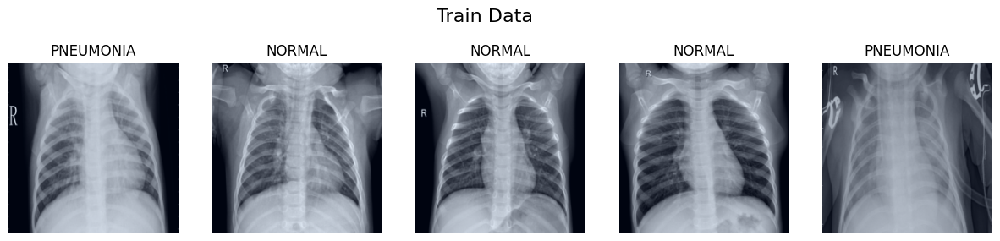
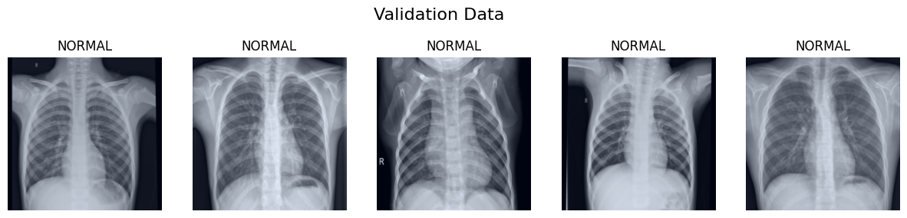
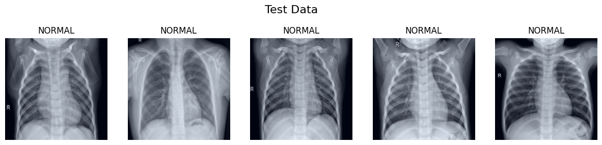
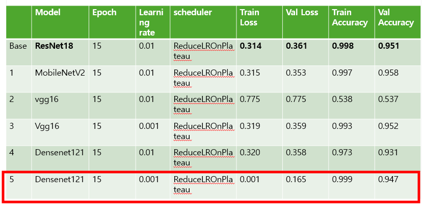
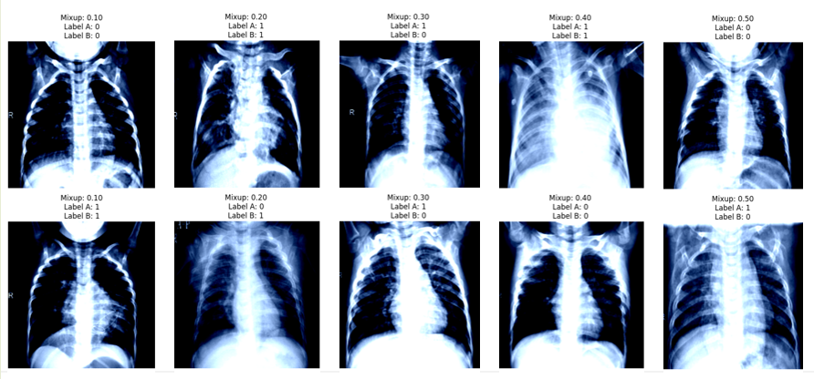
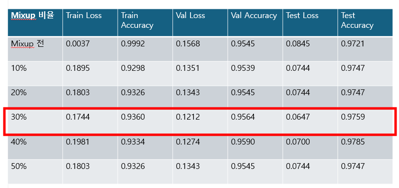
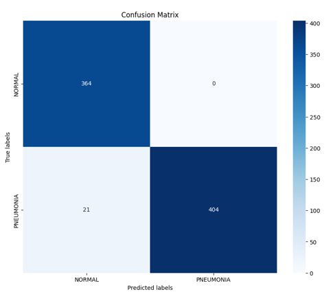

# Pneumonia X-ray Binary Classification

## 프로젝트 개요
폐렴 엑스레이 이미지 분류 프로젝트입니다. 이 프로젝트에서는 의료 영상 데이터를 사용하여 폐렴 여부를 이진 분류하는 모델을 개발하였습니다. 딥러닝을 활용하여 흉부 X-ray 영상을 분석하고 폐렴을 자동으로 진단하는 모델을 개발하는 것입니다. 이를 통해 의료진의 진단 과정을 보조하고, 진단의 신속성과 정확성을 향상시키는 것을 목표로 합니다.

---

## 프로젝트 설명
이 프로젝트는 다음과 같은 작업을 포함합니다:
- 데이터 전처리: X-ray 이미지 데이터셋을 불러와 전처리 작업과 Mixup 데이터 증강 수행하였습니다.
- 모델 구축: 여러 딥러닝 모델을 사용하여 분류 모델을 구축하였습니다.
- 모델 학습: Mixup 적용 학습, 학습 모니터링 및 조기 종료 등을 사용하여 모델을 학습시켰습니다.
- 성능 평가: 테스트 데이터와 혼동 행렬 및 지표 계산 사용하여 모델의 성능을 평가하였습니다.

---

## 현재 개선 사항
1. 모델 변경 및 하이퍼파라미터 수정 후 성능 비교
2. 모델 테스트 부분 코드 작성
3. 의료 영상 전용 데이터 증강 기법 탐색 후 적용

---

## 추후 개선 사항
1. GAN으로 데이터 증강
2. 오버피팅 줄이기 위해 Batch Normalization, Dropout 사용

---

## 사용 라이브러리 및 기술
---
      

---

## 사용 데이터셋
데이터셋
데이터셋: Kaggle: Beginner Chest X-Ray Image Classification

이 데이터셋에서는 CNN(Convolutional Neural Network)을 사용하여 환자가 폐렴에 걸렸는지 여부를 분류할 수 있습니다. 데이터셋에는 모델 학습에 사용할 "train" 폴더, 검증에 사용할 "test" 폴더, 학습된 모델을 기반으로 예측을 수행할 이미지를 포함하는 "pred" 폴더가 포함되어 있습니다.

https://www.kaggle.com/datasets/vivek468/beginner-chest-xray-image-classification
---
#*과정*

## 모델 설명 : 사용한 딥러닝 모델의 종류 및 선택 이유

Densenet121 모델로 가장 작은 loss 값이여서 결정

---
## 믹스업: 비율에 따른 결과

30%일때 가장 좋은 결과

---

## 결과

